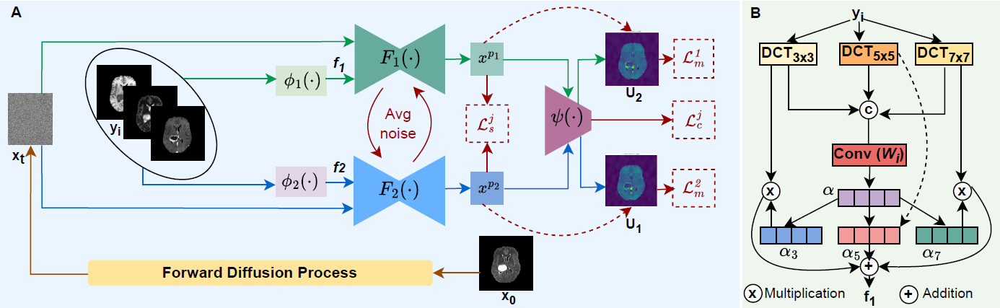
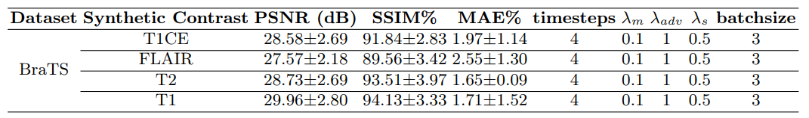

# D2Diff

This repo contains the supported pytorch code and configurations for the Dual-Domain Diffusion Model for Accurate Multi-Contrast MRI Synthesis Article.
Paper : [https://arxiv.org/pdf/2506.15750](https://arxiv.org/pdf/2506.15750)

**D2-Diff Architecture**  <br />


**System Requirement**  <br />
All the experiments of D2Diff are conducted on Ubuntu 20.04 Focal version with Python 3.8.

To train D2Diff with the given settings, the system requires a GPU with at least 40GB. All the experiments are conducted on two Nvidia A40 GPUs.

***Installation Guide***  <br />
Prepare an environment with python>=3.8 and install dependencies.
```
pip install -r requirements.txt
```
**Dataset Preparation**  <br />
The experiments are conducted on one publicly available dataset and one in-house healthy dataset,
  * BraTS2019 Dataset : [https://www.med.upenn.edu/cbica/brats2019/data.html](https://www.med.upenn.edu/cbica/brats2019/data.html)
Sperate each MRI contrast into folders and run pre_process.py to normalize data and extract middle axial slices from nifty files.
```
python pre_process.py
```
This will save the extracted 2D slices from each contrast as [contrast_name].npy.  Then, save the .npy data as in the following structure.
```
data/
├── BRATS/
│   ├── train/
│   │   ├── T1.npy
│   │   └── T2.npy
│   │   └── FLAIR.npy
│   │   └── T1CE.npy
│   ├── test/
│   │   ├── T1.npy
│   │   └── T2.npy
│   │   └── FLAIR.npy
│   │   └── T1CE.npy
│   ├── val/
│   │   ├── T1.npy
│   │   └── T2.npy
│   │   └── FLAIR.npy
│   │   └── T1CE.npy
```
**Train Model**  <br />
To train the model on the brats dataset.
```
python train.py --image_size 256 --exp exp_brats --num_channels 1 --num_channels_dae 64 --ch_mult 1 2 4 --num_timesteps 4 --num_res_blocks 2 --batch_size 3 --num_epoch 30 --ngf 64 --embedding_type positional --ema_decay 0.999 --r1_gamma 1. --z_emb_dim 256 --lr_d 1e-4 --lr_g 1.6e-4 --lazy_reg 10 --num_process_per_node 2
```

**Hyperparameter Setting and Experimental Results.**  <br />


**Test Model**  <br />
```
python test.py --image_size 256 --exp exp_brats --num_channels 1 --num_channels_dae 64 --ch_mult 1 2 4 --num_timesteps 4 --num_res_blocks 2 --batch_size 1 --embedding_type positional  --z_emb_dim 256  --gpu_chose 0 --input_path '/data/BRATS' --output_path '/results'
```

**Acknowledgements**  <br />
This repository makes liberal use of code from [Tackling the Generative Learning Trilemma](https://github.com/NVlabs/denoising-diffusion-gan)
